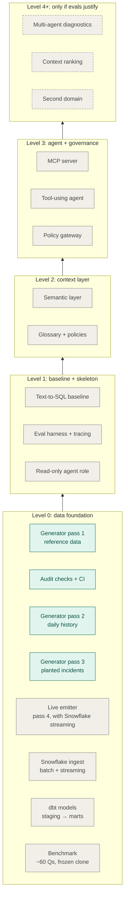

# 01. Components by level

Each level builds on everything below it. Level 4+ is built only if evaluations justify it.

```mermaid
flowchart BT
    subgraph L0["Level 0: data foundation"]
        direction LR
        P1["Generator pass 1<br/>reference data"]:::built
        AUD["Audit checks + CI"]:::built
        P2["Generator pass 2<br/>daily history"]:::built
        P3["Generator pass 3<br/>planted incidents"]:::built
        P4["Live emitter<br/>pass 4, with Snowflake streaming"]:::planned
        ING["Snowflake ingest<br/>batch + streaming"]:::planned
        DBT["dbt models<br/>staging → marts"]:::planned
        BEN["Benchmark<br/>~60 Qs, frozen clone"]:::planned
    end
    subgraph L1["Level 1: baseline + skeleton"]
        direction LR
        SQL["Text-to-SQL baseline"]:::planned
        EVAL["Eval harness + tracing"]:::planned
        ROLE["Read-only agent role"]:::planned
    end
    subgraph L2["Level 2: context layer"]
        direction LR
        SEM["Semantic layer"]:::planned
        GLO["Glossary + policies"]:::planned
    end
    subgraph L3["Level 3: agent + governance"]
        direction LR
        MCP["MCP server"]:::planned
        AGT["Tool-using agent"]:::planned
        GW["Policy gateway"]:::planned
    end
    subgraph L4["Level 4+: only if evals justify"]
        direction LR
        MA["Multi-agent diagnostics"]:::gated
        RANK["Context ranking"]:::gated
        DOM["Second domain"]:::gated
    end
    L0 --> L1 --> L2 --> L3 --> L4

    classDef built fill:#E1F5EE,stroke:#0F6E56,color:#085041
    classDef planned fill:#F1EFE8,stroke:#888780,color:#444441
    classDef gated fill:#F1EFE8,stroke:#888780,color:#444441,stroke-dasharray:4 3
```
