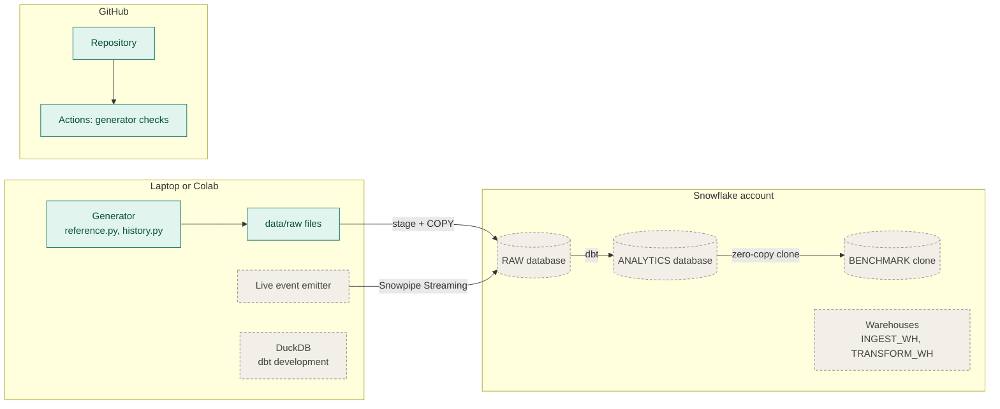

# 02. Deployment: where things run

```mermaid
flowchart LR
    subgraph DEV["Laptop or Colab"]
        GEN["Generator<br/>reference.py, history.py"]:::built
        FILES["data/raw files"]:::built
        STREAM["Live event emitter"]:::planned
        DUCK["DuckDB<br/>dbt development"]:::planned
    end
    subgraph GH["GitHub"]
        REPO["Repository"]:::built
        CI["Actions: generator checks"]:::built
    end
    subgraph SF["Snowflake account"]
        RAW[("RAW database")]:::planned
        ANA[("ANALYTICS database")]:::planned
        BM[("BENCHMARK clone")]:::planned
        WH["Warehouses<br/>INGEST_WH, TRANSFORM_WH"]:::planned
    end
    GEN --> FILES
    FILES -- "stage + COPY" --> RAW
    STREAM -- "Snowpipe Streaming" --> RAW
    RAW -- "dbt" --> ANA
    ANA -- "zero-copy clone" --> BM
    REPO --> CI

    classDef built fill:#E1F5EE,stroke:#0F6E56,color:#085041
    classDef planned fill:#F1EFE8,stroke:#888780,color:#444441,stroke-dasharray:4 3
```

Never deployed anywhere: `data/state/` and `data/ground_truth/` stay local and are used only by the
generator and the evaluation harness.
