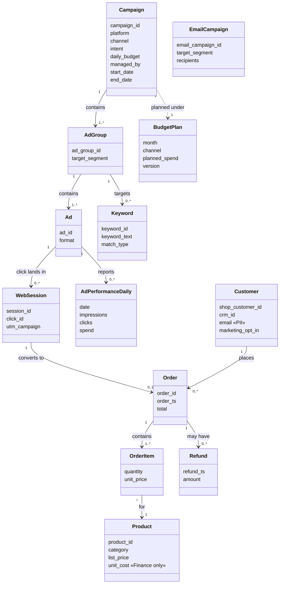

# 03. Domain model (business entities)

Platform-neutral view of Lumen Goods' data. Each platform names these differently
(Google "ad group" = Meta "ad set"); the dbt staging layer maps both onto this model.
All entities are generated as of Pass 2. `WebSession` is derived from web events (sessionized).

