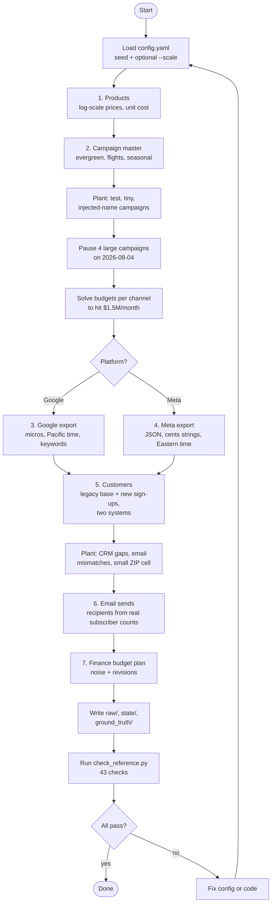

# 04. Generator Pass 1: activity

Pass 2 (history.py) then simulates spend, clicks, orders, refunds and web events from this reference data, including
the July CPC spike and the planted orders (check_history.py, 39 checks). Pass 3 (incidents.py) damages the raw files:
tracking outage, duplicate and late events, Meta restatements and a field rename (check_incidents.py, 26 checks).

