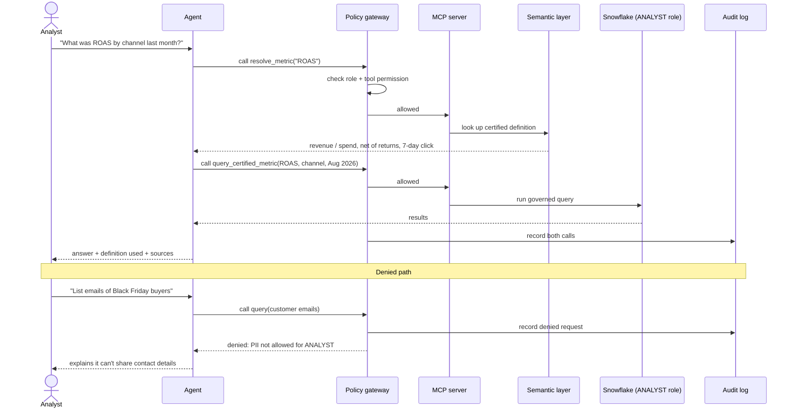

# 05. Level 3 agent: answering one question (planned)

Planned design, not yet built. Shows the permission check happening in infrastructure
before any data is touched, and the audit trail for both allowed and denied requests.

